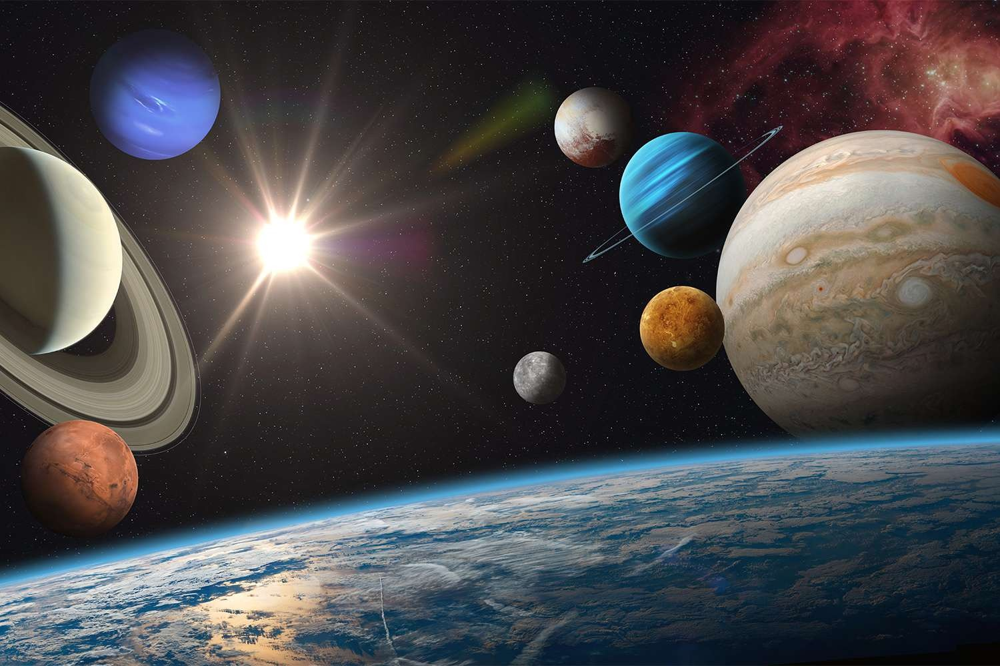
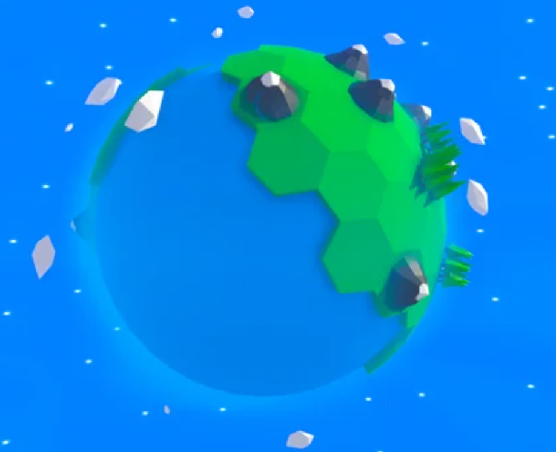
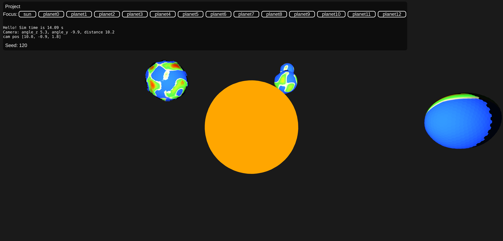
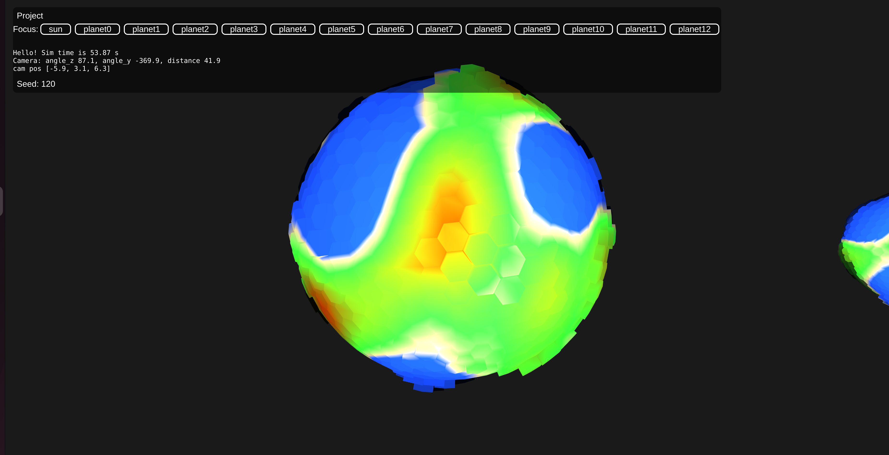

# Project Proposition

As proposed by group 32 consisting of:

- Anders Larsen sciper: 366794
- Charmillot Clément: 307877
- Enrico Benedettini: 367181

# Introduction

## Title: "Solar system with biomes per planet"

This project aims to create an interactive scene that will showcase the generated content. The scene will consist of a solar system with different planets featuring different terrains and biomes depending on their location in the solar system. Planets closer from the sun will have a more desert-like appearance with cacti for example and the opposite for planets far from the sun.
The solar system won't be at scale and plants will be enlarged so they can be seen from the scene. 

* Distance between the planets *
  
* Rough estimate of the scale of the plants and terrain on the planet (Image credit: Reddit) *

# Goals and Deliverables

The core of the project and what is proposed as the requirement for a passing grade, is a clear showcase of the understanding of the procedural generation. Using what is learned from the course to generate different biomes in the solar system environment setup. With a focus on the techniques to generate plants and other flora on the surfaces and add more layers on top of the generation to make it more realistic, the requirement will be to highlight various different techniques to generate said biomes in a solar system environment where the user can move around and inspect the different aspects real-time. The enviroment with planets and biomes is fully rendered, with the extensions as mentioned below.

## Extensions

- Terrain generation
- Make plant switch state based on Day-Night cycle (close flowers, make other plants bend)
- Make water terrain change based on the location of orbiting moon (over-exaggerate)

# Schedule

- Week 1: Procedural solar system generation
  - Setup the coding environment (Everybody)
  - Implement a solar system-like procedural generation algorithm. (Anders)
  - Implement the mesh render of the planets as sphere of hexagons. (Clément)
  - Implement the shader for the planets. (Enrico)
  - Implement the orbit of the planets. (Anders)
  - Implement the shadows for the light emitted from the sun. (Clément)
- Week 2: Plant generation
  - Implement the procedural generation of a single plants with some variation as different types of plant. (Enrico)
  - Implement the procedural generation of plants on the planet. (Anders)
  - Implement the plant shader. (Clément)
- Week 3: Terrain generation (Hexagons for the surface of the planets to simplify the texture and allow for simpler differentiating of biomes).
  - Implement the noise function to generate terrain heightmap. (Enrico)
  - Edit the planet shader to render textures based on the heightmap and distance from the sun. (Anders)
  - Adjust the plant position to take into account the terrain. (Clément)
  - Edit the procedural algorithm that places plants on the planet to take into account the terrain type. (Enrico)
- Week 4: Make plant switch state based on Day-Night cycle
  - Implement a night version of the generation for each plant. (Anders)
  - Make plants switch to their night version when they are in the shadow of a planet. (Clément)
- Week 5: Moon influence on water + other interesting features that might arise. (Enrico)

# Milestone Report

CS-341 Solar System with Biomes per Planet Project

03/05/2023
Will try and set up the solar system environment following the assignments we have previously made. From this we need to implement the different planets. 
    • The shading will be different seeing as the plants are going to be hexagonal. 
    • The sun we can keep. 
    • The camera moving around will be the same.
Using mulberry 32 as seed generation algorithm. From this seed the solar system should be generated.
The planets’ self-rotation speed is now also based on spin-orbit-coupling. This means that planets that are larger (and thus has more mass) will rotate slower than the ones with a smaller mass. Similarly, planets that are further away from the star (sun), will rotate faster due to the lack of gravitational pull that the star exudes on the planet.
The planets inclination is also varying between two fixed values to generate a more vibrant solar system.
Starting on creating planets based on Hexagons. This is a hard task, as we are starting from a cube and performing chamfering to increase the spherical nature of the cube. There are methods for this easily implemented in Blender / Unity, but doing this for WebGL has proven difficult, without using the “THREE” package.
Used this GitHub for generating hexaspheres in the solar system environment. https://github.com/arscan/hexasphere.js Ran into a problem while integrating it. Due to where the code was placed, the meshes for the planets were all identical, meaning that we were unable to change the meshes for planets that are larger / smaller, which otherwise would be beneficial. The code was moved, which fixed the above-mentioned problem, but now it produced lag as every separate mesh is generated every frame. 
The environment is now generated with the option to change the view to each of the planets. 
Working further with the shading, creating our own shader written in GLSL that should work for every planet in the solar system. We wish to implement the Blinn-Phong model as it is newest rendition of the ones we have been effectively introduced to. The model is popular due to its ability to produce smooth highlights without excessive compilations, and thus works great for real-time rendering. 
Add offset to planets so they don’t start in a line when the solar system is generated.

These are some screenshots from the actual ongoing situation of our project:

Hexagons are now implemented, and we're only missing the shading based on the heigth. Otherwise, everything is fine.

Next:
    • Generate plants
    • Moons- as part of the solar system. It will not be a difficult task to implement moons but is left out for now as to focus on more important things.

Random ideas:
    • Shooting stars / asteroids (either happens at set intervals or by button on interface). Can impact nearby planets. 
    • Deathstar – Texture mapping and changing the rendition of a planet to the deathstar (or maybe easier to add the deathstar as a new planet / object entirely). Play some music as well? 

# Updated schedule

- Week 1: Procedural solar system generation
  - Setup the coding environment (Everybody)
  - Implement a solar system-like procedural generation algorithm. (Anders) done
  - Implement the mesh render of the planets as sphere of hexagons. (Clément) done
  - Implement the shader for the planets. (Enrico) done 
  - Implement the orbit of the planets. (Anders) done
  - Implement the shadows for the light emitted from the sun. (Clément) to do
- Week 2: Plant generation
  - Implement the noise function to generate terrain heightmap. (Enrico) done
  - Implement the procedural generation of a single plants with some variation as different types of plant. (Enrico) working on it
  - Implement the procedural generation of plants on the planet. (Anders) working on it
- Week 3: Terrain generation (Hexagons for the surface of the planets to simplify the texture and allow for simpler differentiating of biomes).
  - Implement the plant shader. (Clément)
  - Edit the planet shader to render textures based on the heightmap and distance from the sun. (Anders)
  - Adjust the plant position to take into account the terrain. (Clément)
  - Edit the procedural algorithm that places plants on the planet to take into account the terrain type. (Enrico)
- Week 4: Make plant switch state based on Day-Night cycle
  - Implement a night version of the generation for each plant. (Anders) 
  - Make plants switch to their night version when they are in the shadow of a planet. (Clément)
- Week 5: Moon influence on water + other interesting features that might arise. (Enrico)
